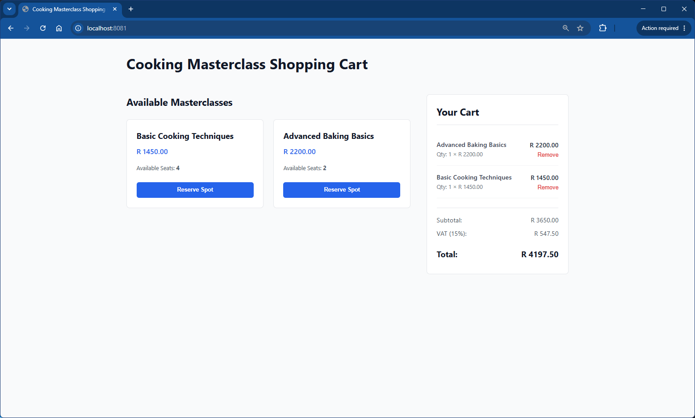

# Cooking Masterclass Shopping Cart Prototype

## Project Overview

This project is a functional single-page shopping cart prototype built with Vue 3. It allows users to browse available culinary masterclasses, add classes to a cart, view real-time quantity adjustments, and automatically calculate subtotals, standard 15% VAT, and final grand totals. The application simulates full e-commerce behavior using responsive design layout components and custom event handling without any external routing packages.

## Installation and Run Instructions

1. Install Node.js from [nodejs.org](https://nodejs.org/)
2. Open your terminal and navigate to the project directory.
3. Run `npm install` to set up project dependencies.
4. Run `npm run serve` to start the local development server on port 8081.

## Components

- **CourseCatalog.vue**: Displays the grid layout of all cooking classes.
- **ProductCard.vue**: Handles structural layouts, real-time seat tracking, and "Sold Out" state management for individual items.
- **CartPanel.vue**: Displays selected items, line totals, VAT calculations, and absolute price summaries.

## Interface Preview

